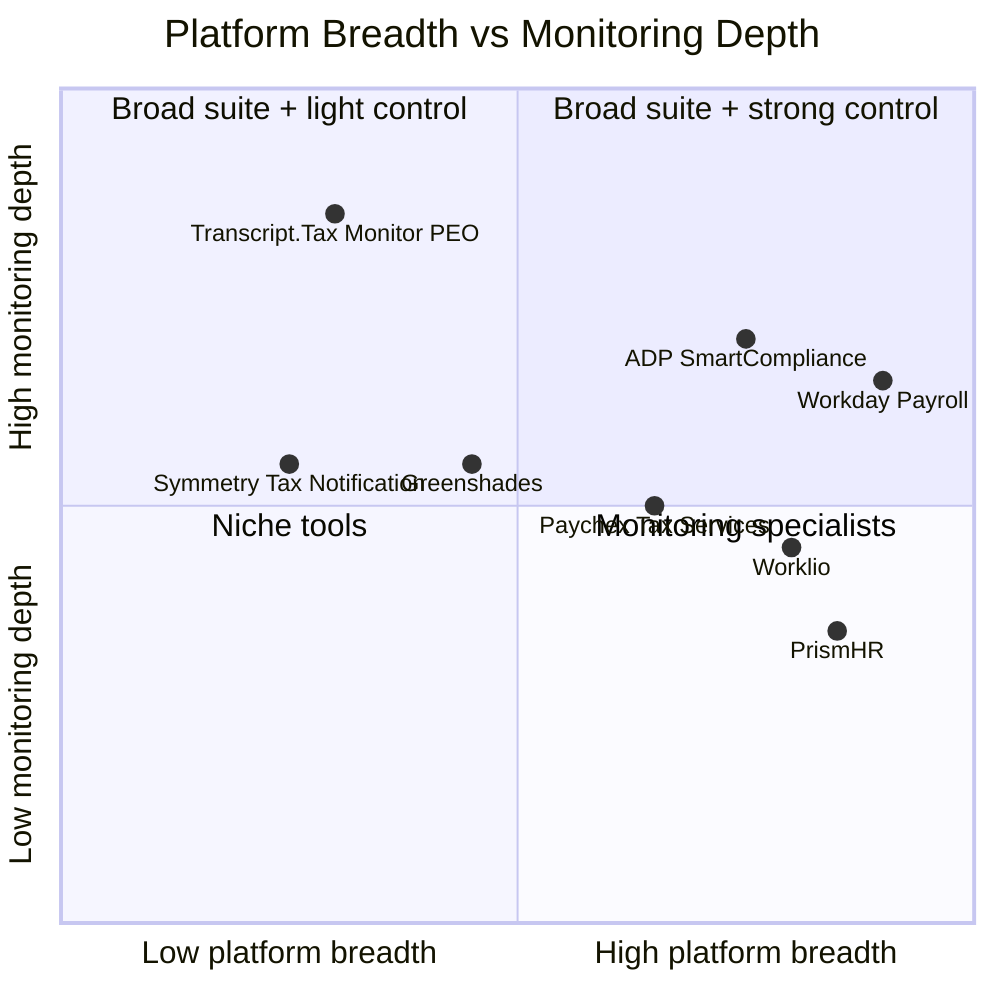
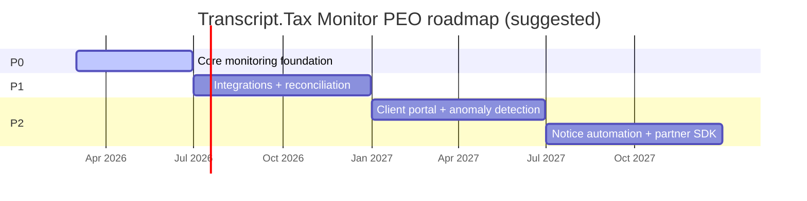

# Transcript.Tax Monitor PEO Market Research

## Executive summary

Transcript.Tax Monitor PEO is best understood as a **governance and observability layer** for PEO payroll tax operations: it monitors (not replaces) payroll tax calculation, deposit, filing, and notice workflows across federal/state/local agencies—then turns that into actionable alerts, reconciliations, and audit-ready reporting.

The **U.S. PEO industry is large enough to support a focused B2B compliance-monitoring product**: in 2022 there were **523 PEOs** serving **~208,000 client businesses** and **~4.5M worksite employees**, with **~7.5% average annual worksite-employee growth (2008–2022)**. citeturn15view1turn22view0 The top of the market is concentrated (top 5 PEOs ≈ **39% of worksite employees**), but the long tail is large and fragmented—often the best early target for a specialized monitoring product. citeturn22view0

The **compliance pain is structural**. Under the IRS Certified Professional Employer Organization (CPEO) rules, the CPEO is generally solely liable for paying customers’ employment taxes and files **aggregate employment tax returns** with allocations; **CPEO customers cannot view federal tax deposits/payments made by the CPEO in EFTPS**. citeturn3view0 This creates an information-asymmetry gap and elevates the value of transparent, client-level reporting and reconciliations.

The **downside risk of payroll-tax errors is high**. Federal “failure to deposit” penalties scale up to 15% depending on lateness, and “trust fund” enforcement can create personal liability for responsible persons, with penalties equal to the unpaid trust fund tax (plus interest). citeturn0search2turn20view1 Information-return penalties (W-2/1099, etc.) can be material at scale (per-return amounts published annually). citeturn8search1 These penalties, plus multi-jurisdiction complexity and agency notices, are the economic basis for buying monitoring.

The **competitive set is real but “diagonal”**: most vendors either (a) provide full payroll/PEO stacks (PrismHR, Worklio, Justworks, ADP TotalSource) or (b) provide tax-filing/compliance services (ADP SmartCompliance, Paychex tax services, Greenshades) or (c) provide tax-calculation + tax-rate-change alerting infrastructure (Symmetry). A purpose-built “monitoring control plane” can differentiate by being **vendor-agnostic** and **PEO-specific** (multi-EIN, client-level rollups, Schedule R logic, notice tracking, evidence trails). citeturn3view0turn9search18turn9search27turn1search3

Recommended pricing approach: sell to PEOs with **tiered SaaS** (Core/Growth/Scale) priced primarily by **client count or EIN count**, with add-ons for notice automation and premium support. Benchmarks show the PEO buyer is already used to PEPM economics (e.g., PEO costs commonly expressed as % of payroll or PEPM ranges; some PEOs publish PEPM pricing), so per-client/per-EIN monitoring fees should be digestible if they reduce penalties, rework, and client risk. citeturn6search3turn13search2

## Product definition and core features

**Assumed product scope (as requested):** Transcript.Tax Monitor PEO monitors payroll-tax compliance health end-to-end and produces alerts + audit-ready evidence. It integrates with payroll/HRIS systems, normalizes obligations and confirmations, and provides dashboards for PEO internal teams plus (optionally) PEO client visibility.

**Why “monitoring” (not “filing”) is a distinct product category in PEOs:**  
* In a CPEO relationship, the CPEO files aggregate returns and makes deposits under its EIN; customers can’t see those deposits in EFTPS, even though the customer still cares deeply about proof and correctness. citeturn3view0  
* When businesses outsource payroll, the IRS emphasizes that employers can remain legally responsible for taxes due even if a provider fails; the IRS explicitly advises employers to monitor deposits (e.g., via EFTPS) and choose providers carefully. citeturn21view0turn4view0

**Core capability map (recommended baseline):**

| Capability area | What it should do in a PEO context | Evidence this is valued in-market |
|---|---|---|
| Alerts and workflows | Route issues to the right operator (tax, payroll, client service), with SLA timers and “next best actions.” | Payroll/tax vendors market “compliance tracking,” “timely response to agency notices,” and deadline alerts as primary value. citeturn1search3turn14search3turn9search33 |
| Dashboards | Provide “single pane of glass” spans: client status, jurisdiction status, open notices, upcoming deadlines, exception queue. | Vendors explicitly market dashboards/auditing (Workday payroll auditing; Greenshades centralized filings; OSV visibility for Workday customers). citeturn10search3turn9search33turn10search23 |
| Integrations | Pull payroll results, liabilities, and entity mappings from payroll/HRIS; push exceptions into ticketing; expose APIs/webhooks. | PEO platforms emphasize integrated payroll/HR/benefits/compliance as core; payroll compliance vendors emphasize integrations/connectors. citeturn1search2turn9search27turn10search11 |
| Notice and correspondence tracking | Ingest agency notices (federal/state/local), tie to underlying period/entity, and track lifecycle from receipt → resolution. | ADP SmartCompliance markets “timely response to agency notices and interactions,” and similar claims appear in compliance tooling. citeturn1search3 |
| Reconciliation and evidence | Prove “what should have happened” vs “what did happen”: liabilities vs deposits vs filings vs allocations, with immutable audit trails. | Workday markets continuous audit trails and smart audits; PEO compliance depends on being able to evidence correctness. citeturn10search3turn3view0 |
| Tax-rate and rule-change monitoring | Maintain a change log (rates, thresholds, filing frequencies, local taxes) and warn before operational impact. | Symmetry explicitly markets tax-rate-change notifications; Paychex markets real-time rate updates and compliance tracking. citeturn9search18turn14search3 |

**PEO-specific feature requirements (where generic payroll monitoring often fails):**
* **Multi-EIN / multi-entity:** some PEO systems explicitly market multi-EIN support, indicating this is a real operational need in the segment. citeturn9search27  
* **Aggregate filer allocation (Schedule R):** CPEOs file aggregate employment tax returns and allocate per customer; monitoring should validate allocation completeness and map client rollups. citeturn3view0  
* **State-by-state complexity:** state-specific rules (particularly around workers’ comp policy/reporting in employee leasing arrangements) vary; clients and PEOs face jurisdictional nuance. citeturn8search2turn8search3

## Target customers and buyer personas

**Primary target segment: PEOs (including CPEOs and non-CPEOs).** The U.S. market includes hundreds of PEOs and hundreds of thousands of client businesses. citeturn15view1turn22view0 The buying trigger is rarely “we need payroll,” but rather **we need fewer notices, fewer exceptions, fewer client escalations, and stronger audit defensibility**.

**Secondary target segments (adjacent but important):**
* **Payroll service providers and HCM platforms embedding payroll:** these buyers benefit from tax change notifications and compliance monitoring to reduce rejections and support costs. citeturn9search6turn9search18  
* **SMBs using PEOs (via white-labeled client reporting):** the IRS emphasizes that outsourcing does not remove responsibility in many arrangements; SMBs value visibility and early warning, especially around notices and deadlines. citeturn4view0turn21view0  
* **Accountants/advisors supporting PEO clients:** compliance checklists, reminders, and “catch problems early” messaging is a demand signal in the ecosystem. citeturn14search12turn19view0

**Buyer personas (alphabetical):**

| Buyer persona | Core job-to-be-done | What they optimize | Likely objections |
|---|---|---|---|
| Accountant / Advisor | Reduce client escalations; produce audit-ready artifacts fast | Responsiveness, reputation, risk reduction | “Will this integrate cleanly with what my clients already use?” |
| Compliance Manager | Maintain policy/process adherence; pass audits; reduce regulator friction | Evidence trails, coverage, timeliness | “We already have a vendor; why another system?” |
| Controller / CFO | Reduce penalties and rework; lower operational risk | Cost-to-serve, predictability | “What’s the ROI vs our existing payroll provider?” |
| Payroll Manager | Stop exceptions before they become notices; reconcile filings | Cycle time, accuracy, workload | “We don’t have bandwidth to implement.” |
| PEO Client Success Leader | Prevent churn and fire drills; provide trustworthy reporting to clients | NPS, retention, escalations | “Will dashboards confuse clients or create more tickets?” |
| Tax Ops Lead | Detect late/incorrect deposits/returns early; manage notices end-to-end | Notice volume, error rate, SLA adherence | “Can you handle multi-EIN, multi-state nuance at our scale?” |

**Buying motion reality for PEOs:**  
Expect a **multi-stakeholder purchase** (tax ops + payroll ops + finance + IT/security). The “economic buyer” is frequently finance (Controller/CFO), but the “power user” is tax/payroll operations. This is consistent with how major providers position their compliance offerings: as operational risk reduction and capacity freeing (outsourced filing/notice management, automated compliance tracking). citeturn1search15turn14search3turn10search2

## Competitive landscape and pricing benchmarks

### Competitor overview table

Rows sorted alphabetically by vendor.

| Vendor | Category | Monitoring-relevant claims in official materials | Pricing model (public) | Primary target customers |
|---|---|---|---|---|
| entity["company","Aatrix","tax forms efile provider"] | Tax form e-file tooling | Markets W-2 eFile services that work with many payroll systems; also markets “compliance” and validation to reduce rejections. citeturn9search0turn9search16turn9search28 | Unspecified / mixed (some tooling described as free; services vary). citeturn9search0 | SMBs and payroll-software ecosystems needing W-2/1099 and other form filing. citeturn9search0turn9search28 |
| entity["company","ADP","payroll and hcm provider"] | PEO + tax compliance suite | SmartCompliance for Payroll Taxes markets tracking of evolving legislation and timely response to agency notices; TotalSource markets integrated payroll/benefits/compliance as a PEO. citeturn1search3turn13search0 | Quote-based for most offerings (typical enterprise sales motion). citeturn1search3turn13search0 | Mid-market/enterprise payroll + SMB/mid-market PEO clients. citeturn13search0turn1search15 |
| entity["company","Greenshades","payroll tax compliance vendor"] | Tax & compliance platform | Markets deadline alerts, centralized tax/information returns, and compliance checks plus tax experts. citeturn9search33turn9search1 | Quote-based / unspecified. citeturn9search33 | Mid-market employers and ERP/payroll ecosystems. citeturn9search5turn9search1 |
| entity["company","Gusto","smb payroll provider"] | SMB payroll platform | Publishes payroll plan pricing; includes tax filings and payments as plan features. citeturn10search0 | Published base + per-person pricing. citeturn10search0 | SMBs running payroll directly (not primarily PEOs). citeturn10search0 |
| entity["company","Justworks","peo and payroll provider"] | PEO with transparent pricing | Markets payroll tax filings, employment-related tax forms, reminders around deadlines and law changes, and W-2/1099 filing; publishes PEPM pricing. citeturn19view0turn13search2 | Published PEPM (Payroll and PEO plans). citeturn13search2turn19view0 | SMBs buying PEO + payroll. citeturn13search2turn19view0 |
| entity["company","Paychex","payroll and hr provider"] | Payroll + PEO + tax services | Tax services page markets end-to-end payroll tax automation plus “real-time rate updates and compliance tracking.” citeturn14search3 | Mostly quote-based (common; some estimates exist). citeturn14search1turn14search2 | SMB to mid-market payroll and PEO buyers. citeturn14search0turn14search4 |
| entity["company","PrismHR","peo software provider"] | PEO software platform | Markets an integrated platform covering payroll, benefits, and compliance for HR outsourcers / PEOs. citeturn1search2turn1search10 | Quote-based / unspecified. citeturn1search2 | PEOs / HROs providing HR services to SMBs. citeturn1search2turn1search10 |
| entity["company","Rippling","hr and payroll platform"] | HR + payroll platform | Published approach: modular per-employee-per-month pricing; payroll is an add-on. citeturn10search1 | Partly published structure; quote varies by modules. citeturn10search1 | SMB to mid-market, including distributed teams. citeturn10search1 |
| entity["company","Symmetry Software","payroll tax api provider"] | Payroll tax infrastructure + alerts | Markets payroll tax APIs + “Tax Notification Service” for payroll withholding tax rate changes. citeturn9search18 | Quote-based / usage-based (API licensing; not publicly standardized). citeturn9search6turn9search18 | Payroll providers, platforms, and enterprises building payroll. citeturn9search6turn9search18 |
| entity["company","UKG","workforce management company"] | HCM suite with compliance | Markets automation of tax filing and year-end forms with expert oversight (compliance positioning). citeturn10search2 | Quote-based / unspecified. citeturn10search2 | Mid-market and enterprise HCM/payroll buyers. citeturn10search2turn10search10 |
| entity["company","Workday","enterprise hr software company"] | Enterprise payroll + auditing | Markets continuous embedded auditing, always-on audit trails, and “smart audits,” plus audit reports/dashboards. citeturn10search3turn15view2 | Enterprise quote-based. citeturn10search7turn10search3 | Enterprise payroll and HCM. citeturn10search7turn10search3 |
| entity["company","Worklio","peo platform provider"] | PEO/ASO & embedded payroll platform | Markets embedded payroll + tax admin, multi-state coverage, and explicitly “manage multiple EINs.” citeturn9search27turn9search3 | Quote-based / unspecified. citeturn9search3turn9search27 | PEOs/ASOs and platforms embedding payroll. citeturn9search3turn9search27 |

### High-level feature comparison matrix (monitoring lens)

Values are limited to what is explicitly marketed in accessible vendor materials; gaps are marked **Unspecified** rather than assumed.

| Feature | Aatrix | ADP | Greenshades | Justworks | Paychex | Symmetry Software | Workday | Worklio |
|---|---|---|---|---|---|---|---|---|
| Agency notice handling | Unspecified | Yes (notice response) citeturn1search3 | Unspecified | Unspecified | Unspecified | Unspecified | Unspecified | Unspecified |
| Audit trails / smart audits | Unspecified | Unspecified | Unspecified | Unspecified | Unspecified | Unspecified | Yes citeturn10search3 | Unspecified |
| Compliance alerts / reminders | Unspecified | Yes (legislation tracking) citeturn1search3 | Yes (deadline alerts) citeturn9search33 | Yes (deadline/law reminders) citeturn19view0 | Yes (“catch problems early,” compliance tracking) citeturn14search3turn14search12 | Yes (rate-change alerts) citeturn9search18 | Unspecified | Unspecified |
| Multi-EIN support | Unspecified | Unspecified | Unspecified | Unspecified | Unspecified | Unspecified | Unspecified | Yes citeturn9search27 |
| Payroll tax filings & deposits | Yes (forms e-file) citeturn9search0turn9search28 | Yes (tax filing services) citeturn1search3 | Yes (tax filings/returns mgmt) citeturn9search33turn9search9 | Yes citeturn19view0turn13search2 | Yes citeturn14search3 | Unspecified (focus is calculation + data) citeturn9search6turn9search18 | “Tax updates” and auditing (filing via chosen service) citeturn15view2 | Yes (embedded tax admin) citeturn9search27 |
| Tax-rate updates | Unspecified | Yes citeturn1search3 | Unspecified | Unspecified | Yes citeturn14search3 | Yes citeturn9search18 | Yes (automatic tax updates) citeturn15view2 | Unspecified |
| W-2 / 1099 support | Yes citeturn9search0turn9search16 | Unspecified | Yes (1099 and others) citeturn9search33 | Yes citeturn19view0 | Unspecified | Unspecified | Unspecified | Yes citeturn9search27 |

### Pricing benchmarks relevant to Transcript.Tax Monitor PEO

**PEO pricing structures (context for willingness-to-pay):**
* PEOs may charge either **% of payroll** or **per-employee-per-month**; one current reference range is **2%–12% of total payroll** or **$40–$160 PEPM** (administrative costs vary). citeturn6search3  
* Some PEO providers publish pricing: Justworks lists **Payroll: $8/employee/month + $50 base fee** and **PEO Basic: $79/employee/month**. citeturn13search2turn19view0

**Payroll software pricing (SMB baseline for “software budget muscle memory”):**
* Gusto’s Simple payroll plan is **$49/month + $6/person** and includes tax filings and payments. citeturn10search0

**Tax compliance / monitoring tool pricing transparency:** commonly **quote-based** for mid-market and enterprise offerings; this is consistent with how major vendors present tax services and compliance modules (Paychex, ADP SmartCompliance, UKG, Workday). citeturn14search1turn1search3turn10search2turn10search3

### Recommended pricing tiers for Transcript.Tax Monitor PEO

Tier names are alphabetical (Core, Growth, Scale). Dollar figures are recommendations anchored to published market price signals above (PEPM PEO pricing and common quote-based compliance tooling); they are not publicly verifiable market prices for this exact niche.

| Tier | Who it’s for | Included scope (summary) | Recommended price |
|---|---|---|---|
| Core | Small PEOs and ASOs | Client/EIN monitoring, compliance calendar + alerts, dashboard, CSV imports, evidence pack exports | $750/month + $15/client/month |
| Growth | Mid-market PEOs | Everything in Core + API access, notice ingestion, reconciliation reporting, role-based access controls | $2,500/month + $12/client/month |
| Scale | Large/multi-entity PEOs | Everything in Growth + multi-EIN controls, client portal/reporting, SSO/SAML, advanced anomaly detection, premium support SLA | $6,000/month + $8/client/month |

Recommended add-ons (alphabetical): **Agency Notice Automation**, **Custom Integrations**, **Dedicated Compliance Analyst**, **Premium Evidence Pack**.

## Market sizing, growth, and regulatory drivers

### Market size and growth framing

**U.S. PEO core market (direct TAM for a PEO-first monitoring tool):**
* **523 PEOs**, **~208,000 clients**, **~4.5M worksite employees** (end of 2022). citeturn15view1  
* Industry concentration: top 5 PEOs ≈ **39%** of worksite employees; the remaining ~493 PEOs still represent ~42% of worksite workers. citeturn22view0  
* NAPEO also promotes a larger “industry revenue” figure (e.g., **$414B**) and “200k+ clients,” indicating the association views the sector as economically significant and growing. citeturn5view0

**Adjacent software and services markets (indirect TAM / expansion paths):**
* U.S. HR & payroll software: IBISWorld’s published market-size snippet shows **~$16.0B in 2024** for “HR & Payroll Software in the US.” citeturn6search16  
* Global HR software: Grand View Research estimates **$16.43B (2023)** growing to **$36.62B (2030)** at **~12.2% CAGR**. citeturn18search1  
* Global payroll administration BPO (a narrower segment definition than all payroll outsourcing): Grand View Research estimates **$4.28B (2025)** growing to **$9.61B (2033)** at **~10.7% CAGR**. citeturn18search0  
* Global payroll outsourcing: market-sizing estimates vary by definition; one example places the market at **~$13.21B (2026)** growing to **~$17.83B (2031)** at **~6.19% CAGR**. citeturn6search9  

**Interpretation:** Transcript.Tax Monitor PEO’s “natural” beachhead (U.S. PEOs) is modest in customer count but high in compliance-critical workflows. The expansion TAM is larger if the product generalizes to payroll providers, embedded payroll platforms, and enterprise payroll governance.

### Regulatory drivers and compliance risks

**Federal deposit penalties create a strong economic incentive to detect issues early:**
* The IRS “Failure to Deposit” penalty rates scale by lateness (2%, 5%, 10%, up to 15% under certain conditions). citeturn0search2

**Trust fund enforcement can create personal exposure:**
* IRS guidance states trust fund recovery penalties can create **personal liability** and the penalty can equal the full amount of unpaid trust fund tax (plus interest). citeturn20view1turn20view0

**Information returns penalties (W-2/1099) scale materially for high-volume filers:**
* The IRS publishes per-return penalties annually (e.g., per-return charges by lateness tiers for 2026). citeturn8search1

**Third-party payer and PEO structures create monitoring needs:**
* The IRS states employers outsourcing payroll can remain responsible if a provider defaults, and the IRS advises monitoring and choosing trusted providers. citeturn21view0turn4view0  
* For CPEO customers specifically: the CPEO is generally solely liable for paying employment taxes for worksite employees; it files aggregate returns and customers **cannot view CPEO-made deposits via EFTPS**. citeturn3view0  
* CPEO certification also includes ongoing requirements such as bonding calculated as a percentage of liability (with minimum and maximum values), reflecting regulatory emphasis on financial assurance. citeturn2view2

**State-level complexity matters in PEO operations:**
* Workers’ comp and employee leasing arrangements have state-specific requirements (NCCI provides state-by-state guides and emphasizes variation). citeturn8search2turn8search10  
* California’s labor agency explicitly warns that engaging a PEO “does not release you from liability” for workers’ compensation coverage, a reminder that client risk still exists even with outsourcing. citeturn8search3

**Regulatory and assurance ecosystems reinforce demand for monitoring:**
* ESAC positions itself as providing accreditation and financial assurance for PEO reliability and regulatory compliance; accreditation-related materials emphasize verification and monitoring expectations in the PEO market. citeturn12search0turn13search17  
* NAPEO explicitly endorses ESAC and the Certification Institute as mechanisms to promote professional practices, indicating industry emphasis on documented controls. citeturn12search14  

## Positioning, go-to-market, and recommendations

### Positioning and differentiation

Most competitors **bundle** payroll + HR + compliance as a suite, or provide **tax filing/compliance services** as part of a broader payroll offering. Transcript.Tax Monitor PEO can win by positioning as:

1) **Vendor-agnostic “control plane”** (monitor across multiple payroll systems and tax services, including migrations and acquisitions).  
2) **PEO-first data model** (multi-EIN, client allocations, co-employment nuance, client-facing evidence packs). citeturn3view0turn9search27  
3) **Proof, not promises**: evidence of deposits/filings/allocations and a defensible audit trail—addressing the visibility gap that exists for CPEO customers and, in many outsourcing arrangements, for employers generally. citeturn3view0turn21view0

Suggested mermaid positioning map (edit coordinates as you refine your ICP):

### Go-to-market channels

Channel options are constrained by the fact that there are only a few hundred PEOs, but they cluster in ecosystems and marketplaces.

| Channel | Why it fits | Concrete execution cue (evidence) |
|---|---|---|
| Co-sell with PEO software platforms | PEOs already buy “platform” products; monitoring can be an add-on for tax ops maturity | PEO platforms position themselves as integrated HR/payroll/benefits/compliance stacks. citeturn1search2turn9search27 |
| Marketplace distribution | Buyers discover integrations via marketplaces; reduces perceived integration risk | Workday Marketplace lists tax filing connectors/services (e.g., ADP Tax Filing Connector, Dayforce Tax & Payment Services). citeturn10search11turn10search27 |
| Compliance-led content + webinars | Compliance reminders/checklists are already used as a lead magnet; monitoring fits that demand | Justworks promotes reminders for deadlines and law changes; Paychex promotes “catch problems early” and compliance calendars/checklists. citeturn19view0turn14search12turn14search16 |
| Direct sales to the long tail | Long tail PEOs (outside top 30) represent a large share of WSEs and are less likely to have bespoke internal control systems | NAPEO footprint shows 493 PEOs collectively represent ~42% of worksite employees. citeturn22view0 |

### SWOT

(Items in each quadrant are alphabetical.)

| Strengths | Weaknesses |
|---|---|
| Audit-ready evidence packs | Brand confusion risk with “IRS transcript monitoring” tools (name overlap) |
| PEO-specific data model (multi-EIN, allocations) | Integration burden across payroll/HRIS variants |
| Vendor-agnostic monitoring (works across providers) | Requires high trust (tax data sensitivity) |
| Opportunities | Threats |
| Alert fatigue reduction (actionable prioritization) | Incumbents can add “good enough” monitoring modules |
| Mid-market PEO consolidation (need unified monitoring across acquisitions) | Long sales cycles with security/compliance reviews |
| White-labeled client reporting (trust differentiator) | Switching-cost lock-in to existing payroll providers |

### Recommended feature roadmap with priorities

Roadmap is grouped by release window; within each window, items are alphabetical.

| Release window | Priority | Deliverables |
|---|---|---|
| 2026 H1 | P0 | Alert routing + SLA timers; Compliance calendar; Entity model (clients, EINs, jurisdictions); Evidence pack export (PDF/CSV); Exception dashboard; Manual imports (CSV/SFTP) |
| 2026 H2 | P1 | API ingestion (REST + webhooks); Notice ingestion (email + upload); Reconciliation engine (liability vs deposit vs filing); Role-based access control; Schedule R support for aggregate filers |
| 2027 H1 | P2 | Anomaly detection (pattern-based); Client portal (white-label); Suggested remediation playbooks; Ticketing integrations (Jira/ServiceNow/Zendesk) |
| 2027 H2 | P2 | Automated notice response workflows (where legally appropriate); Multi-state unemployment rate change monitoring; Partner marketplace listing + embedded distribution SDK |

Suggested mermaid timeline (dates are placeholders; adjust to your repo planning cadence):

### Strategic recommendations

Recommendations are alphabetical by title.

**Build around the “visibility gap” value proposition.**  
Anchor positioning on the fact that CPEO customers cannot view federal tax deposits/payments made by the CPEO in EFTPS, while still needing confidence and proof. Make “client-level evidence packs” a flagship capability and sell it as churn reduction + risk reduction. citeturn3view0

**Focus initial go-to-market on the long tail and mid-market (not the top 5).**  
The largest PEOs are more likely to have mature controls or bundled vendor suites; the long tail is large and still represents a meaningful share of worksite employees. Lead with fast implementation (CSV/SFTP first) and a clear “reduce notices and penalties” ROI story grounded in IRS penalty schedules. citeturn22view0turn0search2

**Partner where tax data already flows.**  
Integrate first with PEO platforms and tax infrastructure vendors (e.g., tax engines/notification services) rather than trying to replace them. Use marketplace listings (like Workday Marketplace-style connectors) as credibility and distribution multipliers. citeturn9search18turn10search11turn1search2

### Sources

Key sources are listed alphabetically by publisher/owner (not exhaustive; citations throughout the document carry the full linkage).

| Source | Why it matters |
|---|---|
| entity["organization","Employer Services Assurance Corporation","peo accreditation body"] | Industry assurance expectations (accreditation/monitoring signals). citeturn12search0turn13search17 |
| entity["company","Grand View Research","market research firm"] | Macro market sizing for HR software and payroll administration BPO. citeturn18search0turn18search1 |
| entity["organization","Internal Revenue Service","us tax agency"] | Primary authority for CPEO liability/visibility, penalties, and outsourcing guidance. citeturn3view0turn0search2turn20view1turn8search1turn21view0 |
| entity["company","IBISWorld","industry research publisher"] | U.S. HR & payroll software market size snippet (industry context). citeturn6search16 |
| entity["company","Mordor Intelligence","market research firm"] | Payroll outsourcing market sizing (definition-dependent but useful for directional context). citeturn6search9 |
| entity["organization","National Association of Professional Employer Organizations","us peo industry assoc"] | Primary U.S. PEO footprint metrics (PEOs, clients, WSE, concentration, growth). citeturn15view1turn22view0turn5view0 |
| entity["organization","National Council on Compensation Insurance","us workers comp data org"] | Evidence of state-by-state complexity in PEO/employee leasing requirements. citeturn8search2turn8search10 |